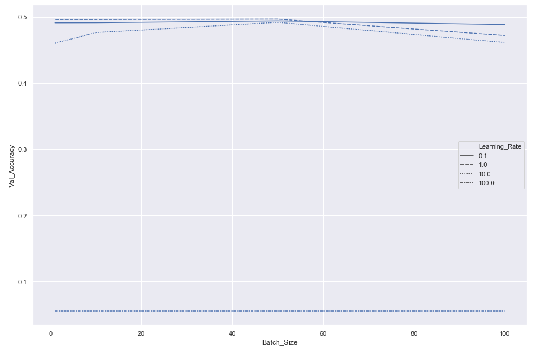
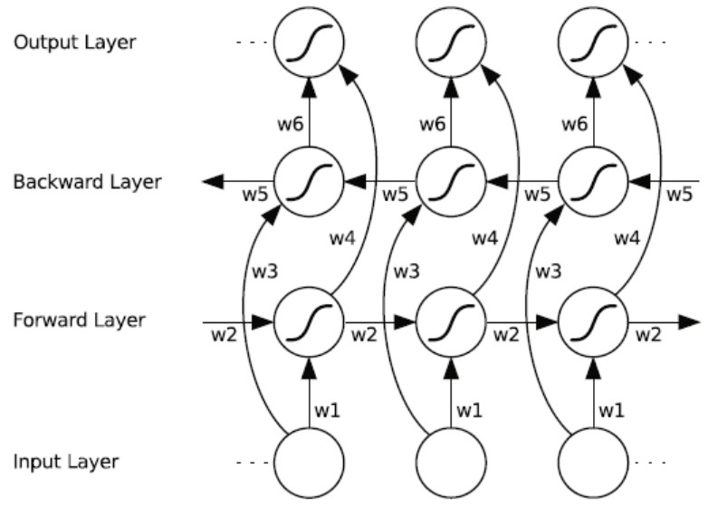

# NLP-beginner

yinzhangyue

## 任务环境

Windows10

Python3.7.6

numpy 1.18.1

pytorch 1.5.1

**运行时请将data中的文件放在code同一目录下运行。**

## 任务一：基于机器学习的文本分类

数据集：[Classify the sentiment of sentences from the Rotten Tomatoes dataset](https://www.kaggle.com/c/sentiment-analysis-on-movie-reviews)

任务：分析句子的情感色彩，共包含5种不同类别的情感，分别标记为0,1,2,3,4

实现要求：NumPy

文本特征表示：Bag-of-Word（将文本中的每个单词用某一个向量表示），N-gram（将文本中连续的N个单词用某一个向量表示），均采用one-hot表示，由于内存限制，采用2-gram。

分类器：softmax回归（多分类任务）

损失函数：交叉熵损失函数（$-\frac{1}{N}\Sigma^N_{n=1}(y^{(n)})^Tlog\hat{y}^{(n)}$）

梯度下降：采用SGD和Mini-Batch，由于内存限制不采用全量梯度下降

特征选择：本次任务中不去除停用词，将文本中包含的所有单词作为特征进行训练

数据集：训练集150000条，验证集6060条，测试集66292条

提前停止：验证集准确率前后差值小于0.01时终止训练

### 词袋模型

学习率分别取0.1、1、10和100，批大小分别取1、10、50、100，准确率结果如下：

结论如下：

1. 由于设定了较为宽泛的停止条件，若干次迭代后就停止训练，因此不同批大小所训练的模型在准确率上没有明显差异；
2. 而模型对于学习率较为敏感，学习率在0.1和1时均能保持50%左右的准确率，设定为10之后准确率有一定下降，设定为100后准确率大幅下降，因为模型震荡严重难以到达局部最优。

### N-gram 模型

学习率分别取0.1、1、10和100，批大小分别取1、10、50，准确率结果如下：

结论如下：

1. 批大小和学习率对于准确率的影响同样也有和词袋模型一样的现象；
2. 在学习率同为0.1和1的情况下，采用2-gram模型相比于词袋模型准确率有一定的提升，因为2-gram模型采集了一定的语序信息，例如“这部电影好看，但我不喜欢”和“这部电影不好看，但我喜欢”是完全不同的两种情感色彩，但如果采用词袋模型得到的却是完全相同的两个向量，而采用2-gram模型就会有一定差异，这就是采用2-gram模型准确率提升的原因，也是N-gram模型的重要优势。

## 任务二：基于深度学习的文本分类

### 用Pytorch重写任务一

采用pytorch复现任务一，由于在任务一中N-gram模型的效果要优于词袋模型，因此直接用pytorch复现2-gram模型，随机embedding的初始化方式，这里不再采用one-hot这种稀疏的编码方式，而是采用稠密编码，将每两个英文单词，例如'A series'，采用nn.Embedding编码成一个100维的词向量，网络结构。

采用train_test_split，按标签比例划分出30%为测试集，其余为训练集。

激活函数：log_softmax（在softmax的结果上再做多一次log运算）

损失函数：交叉熵损失函数

优化方法：Adam

学习率：0.001

batch size：1

Epoch：5

Dropout：以20%的概率损失部分神经元

模型评价：在测试集上准确率为0.463

**不是复现吗？为什么准确率比任务一低那么多？**

因为在任务一中，训练集与测试集的划分是通过选定一段范围进行划分的，导致样本标签不那么均匀，模型比较好判断，因此任务一中的准确率会偏高。

### 双向LSTM网络

这里使用[torchtext.vocab.Vocab](https://torchtext.readthedocs.io/en/latest/vocab.html#vocab)创建词典，建立完词典后，就可以将数据集的文本从字符串的形式转换为单词下标序列的形式，这里将每条评论的长度补全为成500，利用 [torch.utils.data.TensorDataset](https://pytorch.org/docs/stable/data.html?highlight=tensor dataset#torch.utils.data.TensorDataset)创建 PyTorch 格式的数据集，进而采用Data.DataLoader创建数据迭代器。

词嵌入方法：glove模型预训练，glove.6B.100d，将每个单词映射到100维的稠密向量

模型：双向LSTM

模型架构：词嵌入层大小为100，由于加载的是已经训练好的词向量，因此在训练过程中不需要更新，2层LSTM，每层的隐藏单元数量均为100.

损失函数：交叉熵损失函数

优化方法：Adam

学习率：0.01

batch size：64

Epoch：5

模型评价：在训练集上准确率为0.670，在测试集上准确率为0.647

使用了LSTM和预训练的词向量后准确率有了很大的提高。

### 卷积神经网络

采用TextRCNN：[recurrent convolutional neural networks for text classification](https://link.zhihu.com/?target=http%3A//www.aaai.org/ocs/index.php/AAAI/AAAI15/paper/download/9745/9552)

下图用一个例子解释了 TextCNN 的设计。这里的输入是一个有 11 个词的句子，每个词用 6 维词向量表示。因此输入序列的宽为 11，输入通道数为 6。给定 2 个一维卷积核，核宽分别为 2 和 4，输出通道数分别设为 4 和 5。因此，一维卷积计算后，4 个输出通道的宽为 11−2+1=10，而其他 5 个通道的宽为 11−4+1=8。尽管每个通道的宽不同，我们依然可以对各个通道做时序最大池化，并将 9 个通道的池化输出连结成一个 9 维向量。最终，使用全连接将 9 维向量变换为 2 维输出，即正面情感和负面情感的预测。[文字来源](https://www.cnblogs.com/54hys/p/12343458.html)

模型架构：词嵌入层有2层，一层是固定的，即glove预训练词向量，一层是随着模型一同训练的，大小均为100，含3个卷积核，kernel_size分别为3，4，5，out_channels均为100，因此in_channels均为200。

损失函数：交叉熵损失函数

优化方法：Adam

学习率：0.001

batch size：64

Epoch：5

Dropout：最后一层以50%的概率损失部分神经元

模型评价：在训练集上准确率为0.687，在测试集上准确率为0.662

准确率在LSTM的基础上有了进一步的提高。

## 任务三：基于注意力机制的文本匹配

输入两个句子判断，判断它们之间的关系。参考[ESIM]( https://arxiv.org/pdf/1609.06038v3.pdf)（可以只用LSTM，忽略Tree-LSTM），用双向的注意力机制实现。

数据集：https://nlp.stanford.edu/projects/snli/

1. 注意力机制
2. token2token attetnion

## 参考资料

1.https://www.cnblogs.com/54hys/p/12343458.html